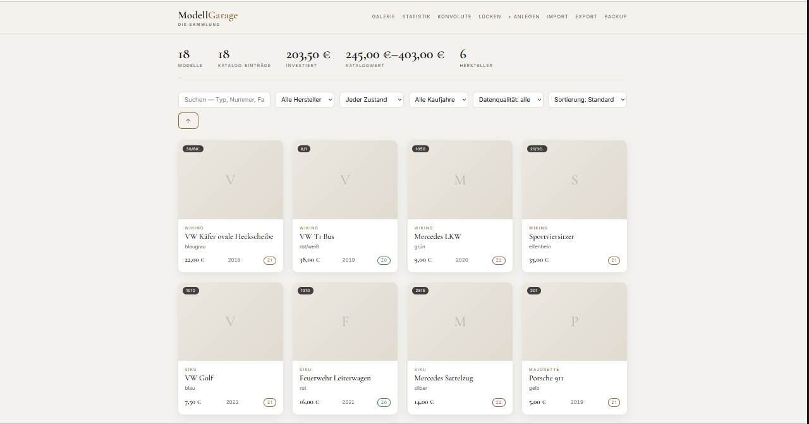
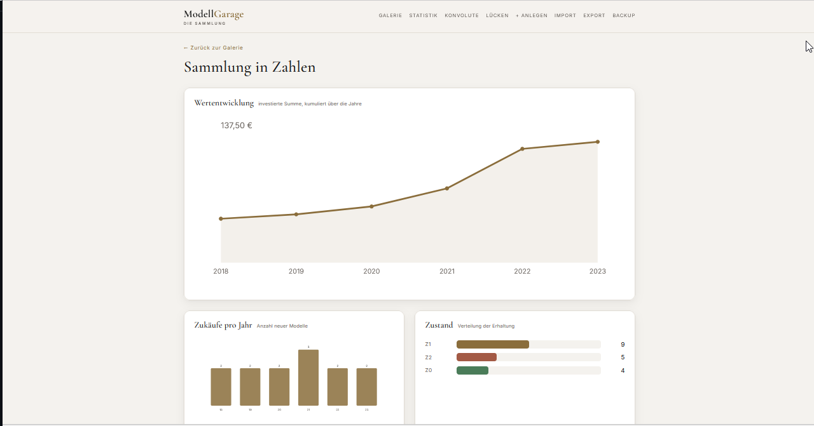
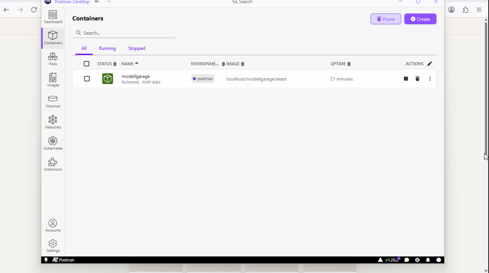

# ModellGarage

🇩🇪 **Deutsch** · [🇬🇧 English](README.en.md)

> **Inventar- & Bewertungs-App für Modellauto-Sammlungen.**
> Aus einer statischen Sammler-Excel wird eine leichtgewichtige, schöne App —
> mit Katalog-Abgleich, Konvolut-Handling und optionaler eBay-Anbindung.

## Screenshots

| Galerie | Statistik |
|:---:|:---:|
| [](docs/screenshots/landingpage.png) | [](docs/screenshots/statistik.png) |
| Sammlung durchsuchen, filtern und sortieren | Wertentwicklung, Zukäufe pro Jahr und Zustandsverteilung |

---

## Idee

Ein leidenschaftlicher Sammler dokumentiert seine Modellautos (Wiking, Siku,
Majorette, Matchbox …) bisher in Excel. ModellGarage überführt diese Daten in
eine echte App: durchsuchbar, mobil bedienbar, mit Fotos und Wertermittlung.

**Kernnutzen:**
- Doppelkäufe vermeiden (Sammlung durchsuchbar)
- Gesamtwert im Blick (Katalog-Schätzwerte)
- **Konvolute** (Auktions-Pakete) sauber aufschlüsseln
- Zustand & Fotos je Modell dokumentieren

---

## Schnellstart

### Lokal (Entwicklung)

```bash
make setup     # venv + Python-Deps + npm ci
make import     # Excel → SQLite (einmalig)
make start      # Backend :8003 + Frontend :5173 (Hot-Reload)
make stop       # beides stoppen
make status     # laufende Prozesse zeigen
```

### Lokal (Produktion, ein Prozess)

```bash
make start-prod  # baut Frontend + FastAPI serviert alles auf :8003
```
→ http://127.0.0.1:8003

## Installation für Nutzer (Windows · macOS · Linux)

Für alle drei Systeme läuft ModellGarage als **Container über Podman** — ein
Fenster, ein Port (`http://localhost:8003`). Keine Python-/Node-Installation nötig.

**Für alle Systeme zuerst:**

1. **Podman installieren** — über den **offiziellen, signierten** Installer:
   - **Windows:** Podman Desktop per winget in einer **Administrator-PowerShell**:
     ```powershell
     winget install -e --id RedHat.Podman-Desktop
     ```
     …oder die signierte `.exe` von https://podman-desktop.io/ herunterladen und
     starten. Podman Desktop richtet dabei **WSL2** (das Linux-Subsystem, das
     Podman braucht) mit ein — dafür sind **einmalig Admin-Rechte** nötig, und
     Windows verlangt beim ersten WSL2-Setup meist **einen Neustart**.
   - **macOS/Linux:** Podman bzw. Podman Desktop von https://podman.io/ (oder über
     den Paketmanager).

   Beim ersten Start von Podman Desktop einmal die Podman-Maschine
   „Initialize / Start" bestätigen.
2. **Projekt holen:** auf GitHub den grünen **„Code"**-Button → **„Download ZIP"**,
   dann entpacken — oder `git clone`.

> **Kurz zu den Admin-Rechten:** Admin wird **nur einmalig** für die Installation
> von Podman Desktop / WSL2 gebraucht (offizieller, signierter Installer). Der
> **spätere Betrieb** der ModellGarage braucht **kein Admin und kein Terminal**:
> `start-podman.bat` per Doppelklick starten, `stop-podman.bat` zum Stoppen — oder
> alles bequem über die Podman-Desktop-Oberfläche.

### Windows — App starten

Podman Desktop ist installiert und läuft (siehe „Für alle Systeme zuerst" oben)?
Dann brauchst du **kein Admin und kein Terminal** mehr:

1. In den entpackten Projektordner gehen — der Ordner, in dem `start-podman.bat`
   liegt (heißt meist `ModellGarage-main`, ggf. doppelt verschachtelt).
2. **`start-podman.bat` doppelklicken.** Beim ersten Mal wird der Container gebaut
   (ein paar Minuten), danach öffnet sich der Browser auf http://localhost:8003.
3. **Stoppen:** **`stop-podman.bat`** doppelklicken.

So sieht es aus, wenn alles läuft — der Container `modellgarage` steht in Podman
Desktop auf **RUNNING**, Port **8003**:

[](docs/screenshots/podman.png)

> **Warum der Container-Weg?** ModellGarage läuft **isoliert** in einem Podman-
> Container (rootless, in einer WSL2-VM) — getrennt von deinem Windows-System.
> Deine Sammlungsdaten bleiben lokal, und Podman Desktop installierst du über den
> **offiziellen, signierten** Installer — kein selbstgebautes Fern-Skript.

> **Was macht `start-podman.bat`?** Die Batch startet nur das **mitgelieferte,
> lesbare** `start-podman.ps1` aus demselben Ordner — sie lädt **nichts aus dem
> Netz nach** und braucht **kein Admin**. Das enthaltene `-ExecutionPolicy Bypass`
> gilt ausschließlich für diesen einen Aufruf des lokalen Skripts (nötig, weil
> Windows Dateien aus einem heruntergeladenen ZIP sonst blockiert) — die
> Sicherheitsrichtlinie deines Rechners bleibt unverändert. Du kannst
> `start-podman.ps1` vorher öffnen und prüfen: es baut nur das Image aus dem
> lokalen `Containerfile`, legt die Volumes an und startet den Container auf
> Port 8003.

> Hinweis: Die `make …`-Befehle weiter unten sind nur für Entwicklung unter
> **Linux/macOS**. Unter Windows immer die `*-podman.bat`-Skripte verwenden.

### macOS / Linux

3. Im Terminal in den Ordner wechseln und starten:
   ```bash
   ./start-podman.sh
   ```
   (baut den Container, wartet, öffnet den Browser auf http://localhost:8003)
4. Stoppen:
   ```bash
   ./stop-podman.sh
   ```
   Alternativ mit `make`: `make podman-up` / `make podman-down` / `make podman-logs`.

### Danach (alle Systeme): Daten einspielen

Die App läuft — jetzt kommen Daten hinein. Es gibt drei Wege:

#### 1. Zuerst ausprobieren (empfohlen)

Ohne eigene Daten die mitgelieferten Testdaten importieren: in der App oben auf
**„Import"** klicken und **`examples/testdaten.xlsx`** hochladen (14 fiktive
Modelle über Wiking, Siku, Majorette, Playmobil — inklusive Dubletten und
Lücken). So siehst du sofort Galerie, Statistik, Lücken und Wunschliste in
Aktion. (Alternativ die kleinere `examples/beispiel-sammlung.xlsx`.) Alle Werte
sind erfunden.

**Konvolute und die Wunschliste** entstehen **nicht** beim Excel-Import. Um auch
die zu testen, nach dem Import einmalig das Seed-Skript laufen lassen (legt zwei
Beispiel-Konvolute mit gewichteter Preisverteilung und Wunschlisten-Einträge an):

```bash
python scripts/seed_testdaten.py        # App muss laufen (http://localhost:8003)
```

#### 2. Eigene Sammlung importieren

Der Import erwartet ein **bestimmtes Spaltenschema** (deutsche Überschriften).
Eine beliebige Tabelle mit anderen Spalten importiert **nicht** sinnvoll — die
erwarteten Spalten sind:

| Hersteller | Nr. | Min. | Max. | Typ | Farbe | Zustand | Bemerkung | bezahlt | Schätzwert | Anzahl | Kaufdatum |

Der einfachste Weg zur passenden Vorlage ist der **Export**:

1. In der App auf **„Export"** klicken → du erhältst eine `.xlsx` mit exakt den
   richtigen Spalten (leer, falls noch keine Daten drin sind).
2. Deine Sammlung dort eintragen — eine Zeile pro Modell. `Zustand` ist
   `z0`/`z1`/`z2`, `Kaufdatum` z. B. `15.11.2020` oder `2020-11-15`.
3. Die Datei über **„Import"** wieder hochladen.

Export und Import passen zusammen: Ein exportiertes Excel lässt sich unverändert
wieder importieren, ohne dass Werte oder Hersteller verloren gehen. Alternativ
`examples/testdaten.xlsx` als Vorlage nehmen und die Zeilen ersetzen.

#### 3. Ohne Excel — direkt in der App erfassen

Du brauchst keine Excel: Oben auf **„+ Anlegen"** trägst du Modelle einzeln ein
(mit Katalog-Abgleich und Zustands-Dropdown). Für eBay-Käufe gibt es unter `/neu`
die Schnellerfassung — Titel/Beschreibung einfügen, die App schlägt Hersteller,
Nr., Farbe, Preis und Zustand vor.

> Deine Daten (Datenbank + Fotos) liegen in den Podman-Volumes und sind beim
> nächsten Start automatisch wieder da.

> Hinweis: Falls `podman compose` meldet, dass „compose" fehlt, in Podman Desktop
> unter *Settings → Extensions* „Compose" aktivieren (oder `podman-compose`
> nachinstallieren). Die Skripte müssen dafür nicht geändert werden.

### Tests (Entwicklung)

```bash
make test        # pytest
```

`make help` zeigt alle Targets.

---

## Volumes & Datensicherheit

Die App läuft als **einzelner Podman-Container**, aber deine Daten liegen bewusst **außerhalb** davon in zwei benannten Volumes. Sie überleben jeden Neustart und Rebuild — die Start-Skripte bauen den Container jedes Mal neu (`podman rm -f` / `compose up --build`), die Volumes bleiben dabei bestehen:

| Volume | Inhalt | Pfad im Container |
|--------|--------|-------------------|
| `modellgarage-media` | hochgeladene **Fotos** | `/app/media` |
| `modellgarage-data`  | die **Datenbank** | `/app/data/modellgarage.db` |

> ⚠️ **Diese Volumes niemals löschen — sonst sind alle Fotos und die komplette Sammlung unwiderruflich weg.**

Gefährliche Befehle, die die Daten vernichten:

```bash
podman volume rm modellgarage-media   # löscht alle Fotos
podman volume rm modellgarage-data    # löscht die Datenbank
podman machine reset                  # löscht ALLE Volumes der Maschine
podman system prune --volumes         # löscht ungenutzte Volumes
```

`stop-podman.*` und `podman compose down` (ohne `-v`) sind dagegen **sicher** — sie stoppen nur den Container und lassen die Volumes stehen.

**Backup** läuft über den **Export in der App** (Excel), *nicht* über Git: die Volumes (`media/`, `data/`) sind absichtlich per `.gitignore` aus dem Repo ausgeschlossen. Exportiere regelmäßig und bewahre die Datei außerhalb des Containers auf.

## Was die App besonders macht

### 1. Katalog-basierte Identität
Jedes Modell hat eine herstellereigene Katalognummer (Wiking `30/6K.`,
Siku `1050`, …). Diese steht **nicht am Modell**, sondern kommt aus dem
jeweiligen Sammlerkatalog. Werte (Min/Max) leben im Katalog, nicht am
Einzelmodell (keine mehrfache Pflege identischer Werte).

### 2. Konvolut-Handling (geplant, Phase 2)
Kauf mehrerer Autos in einer Auktion, ohne Einzelangaben: Konvolut als
Eltern-Datensatz, jedes Auto als Kind, Einzelpreis **nach Katalog-Schätzwert
gewichtet** (nicht stumpf Gesamtpreis ÷ Anzahl).

### 3. Zustand bleibt Handarbeit
Zustand (z0/z1/z2) entscheidet der Sammler per Sichtung — die App bietet nur
ein Dropdown. Optionale Foto-KI (später) schlägt höchstens vor.

### 4. eBay-Schnellerfassung (ohne API)
eBay blockt Server-Fetch (403). Der Sammler kopiert stattdessen **Titel**,
optional **Preis/Zustand** und optional die **Artikelbeschreibung** aus seinem
Browser in `/neu` — die App parst den Text lokal (kein Netzwerk) und füllt
Hersteller, Typ, **Katalog-/Wiking-Nr.**, **Farbe**, Preis, Zustand und Maßstab
als Vorschlag vor. Nr. und Farbe kommen dabei meist aus der Beschreibung —
genau die Felder, die im Titel fehlen. Alles bleibt Vorschlag, der Sammler
bestätigt.

### 5. Fotos & eBay-API (später)
Fotos lädt der Sammler manuell pro Modell hoch (Upload-Endpoint steht). Ein
echter eBay-Import via Browse-API (Developer-Account + OAuth) ist Phase 3,
optional.

---

## Tech-Stack

| Schicht    | Wahl                     | Warum                                              |
|------------|--------------------------|----------------------------------------------------|
| Backend    | **FastAPI** (async)      | Schnell, auto-Swagger, Pydantic V2                 |
| DB         | **SQLite** (aiosqlite)   | Leichteste DB — eine Datei, kein Server, relational|
| ORM        | SQLAlchemy 2.x           | Wie KAiTix; `create_all` im MVP, Alembic vorbereitet|
| Frontend   | **SvelteKit** (Svelte 5) | Schön, schnell, PWA-fähig; `adapter-static`        |
| Deployment | **Podman** (Windows)     | Ein Container, ein Prozess, ein Port (8003)        |
| Fotos      | Lokaler `media/`-Ordner  | Bilder herunterladen/speichern statt verlinken     |

**Design-Prinzip:** leichtgewichtig. Serverlose DB, dünnes Backend, schönes
Frontend im Editorial-Stil (angelehnt an classicdriver.com). Kein MongoDB/
Postgres, kein Kubernetes.

---

## Projektstruktur (Ist-Stand)

```
ModellGarage/
├── app/
│   ├── core/            config.py, database.py (async SQLite, FK-Enforcement)
│   ├── routers/         modelle, statistik, export, fotos
│   ├── services/        excel_import.py (header-getrieben, 18 Blätter)
│   ├── models.py        SQLAlchemy: katalog/modell/konvolut/foto
│   ├── schemas.py       Pydantic V2
│   └── main.py          App + StaticFiles + SPA-Fallback
├── frontend/            SvelteKit 5 (Galerie + Detail)
│   └── src/routes/      +page.svelte (Galerie), modell/[id] (Detail)
├── scripts/             import_excel.py + Verifikations-Helfer
├── tests/               pytest (API)
├── docs/schema.sql      DDL-Referenz
├── Containerfile        Multi-Stage (Node build → Python runtime)
├── compose.yml          Podman/Docker Compose
├── Makefile             make start/stop/test/podman-*
├── data/                SQLite-DB (gitignored)
└── media/               Fotos (gitignored)
```

---

## Datenmodell

```
katalog    (hersteller, katalog_nr, typ, min_euro, max_euro, serie, quelle)
modell     (katalog_id→, farbe, zustand z0/z1/z2, bemerkung,
            bezahlt, schaetzwert, kaufdatum, anzahl, konvolut_id→)
konvolut   (quelle, gesamtpreis, datum)
foto       (modell_id→ | konvolut_id→, pfad, quelle)   # 1:n, eigene Tabelle
```

**Auslieferung:** FastAPI serviert das gebaute SvelteKit + `/media` als ein
einziger Prozess (ein Port, kein separater Node-Server im Betrieb).

---

## Status

🚀 **MVP lauffähig.**
- Excel-Import (header-getrieben, 18 Blätter, ~6.300 Modelle, ~3.250 Katalog-Einträge)
- Backend: CRUD, Suche, Filter, Sortierung, Statistik, Excel-Export, Foto-Upload
- Frontend: Galerie + Detail im Classic-Driver-Design, Suche/Filter/Statistik
- Ein Prozess serviert Frontend + API + `/media` (SPA-Fallback für Deep-Links)
- Podman-Deployment (Multi-Stage-Container) für Windows
- 4 pytest grün, E2E verifiziert

**Phase 2 erledigt:** Konvolut-UI (Eltern/Kind, gewichteter Preis, Fotos),
Wunschliste + Dubletten-Warnung, Statistik-Charts, Foto-Galerie mit Lightbox,
Hersteller-Normalisierung, eBay-Schnellerfassung inkl. Artikelbeschreibung
(Katalog-Nr. + Farbe).

**Phase 2b erledigt:** manuelle Wunschliste (Nummern merken, „gekauft"-Toggle,
aus Lücken übernehmen), Kaufjahr-Filter/-Suche/-Anzeige in der Galerie,
Katalog-Abgleich beim Anlegen (Top-3-Kandidaten), Datenqualitätsfilter
(ohne Foto/Zustand/Kaufdatum), rotierendes Auto-Backup, Import-Regressionstest.

**Offen (Phase 3):** eBay-Import via Browse-API (Developer-Account + OAuth),
Mehrfach-Erfassung aus einer Konvolut-Beschreibung, pflegbarer Katalog (GK/Rawe).

---

## Mitwirken

Die App ist durchgehend auf Deutsch. Ein **Sprachumschalter (DE/EN) in der App**
ist bewusst nicht eingebaut (der Nutzerkreis ist deutschsprachig). Wer ihn haben
möchte, kann gern ein **Issue** öffnen oder einen **Pull Request** beisteuern —
Vorschläge und Verbesserungen sind willkommen.

---

## Lizenz

MIT (siehe `LICENSE`).
